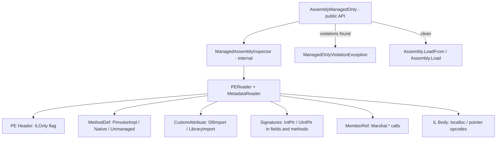

# Implementation Plan: ArtificialNecessity.SaferAssemblyLoader Bootstrap

## Overview

Standalone library that loads .NET assemblies with a managed-only guarantee. Uses `System.Reflection.Metadata` to inspect PE metadata **before** loading. If the assembly contains any unmanaged code surface, it throws before the assembly enters the AppDomain.

- **Package ID**: `ArtificialNecessity.SaferAssemblyLoader`
- **Namespace**: `ArtificialNecessity.SaferAssemblyLoader`
- **Target**: `netstandard2.0`
- **Dependency**: `System.Reflection.Metadata` 7.0.0
- **No dependency** on `AN.CodeAnalyzers`, Roslyn, or anything heavy

---

## File Layout

```
SaferAssemblyLoader/
├── ArtificialNecessity.SaferAssemblyLoader.csproj
├── AssemblyManagedOnly.cs
├── ManagedAssemblyInspector.cs
├── ManagedOnlyViolationException.cs
└── Tests/
    ├── AN.SaferAssemblyLoader.Tests.csproj
    ├── TestAssemblyCompiler.cs
    ├── ManagedAssemblyInspectorTests.cs
    └── AssemblyManagedOnlyTests.cs
```

---

## Architecture



---

## Phase 1: Project Scaffolding

- [ ] Create `SaferAssemblyLoader/ArtificialNecessity.SaferAssemblyLoader.csproj`
  - [ ] Target `netstandard2.0`, `LangVersion` 12.0, nullable enable
  - [ ] `DefaultItemExcludes` for `**/Tests/**`
  - [ ] `PackageId`: `ArtificialNecessity.SaferAssemblyLoader`
  - [ ] `PackageReference`: `System.Reflection.Metadata` 7.0.0
  - [ ] NuGet packaging properties: authors, description, license, repo URL, readme
  - [ ] `GeneratePackageOnBuild`: true
  - [ ] `CopyLocalLockFileAssemblies`: true
- [ ] Create `SaferAssemblyLoader/Tests/AN.SaferAssemblyLoader.Tests.csproj`
  - [ ] Target `net8.0`, xunit 2.7.0, `Microsoft.NET.Test.Sdk` 17.9.0
  - [ ] `PackageReference`: `Microsoft.CodeAnalysis.CSharp` 4.8.0 (for compiling test fixtures)
  - [ ] `ProjectReference` to `../ArtificialNecessity.SaferAssemblyLoader.csproj`
  - [ ] `IsPackable`: false
- [ ] Add both projects to `AN_CodeAnalyzers.sln`
  - [ ] Solution folder `ArtificialNecessity.SaferAssemblyLoader` containing the lib project
  - [ ] Nested `Tests` solution folder containing the test project

---

## Phase 2: Core Implementation

### ManagedOnlyViolationException.cs
- [ ] Namespace: `ArtificialNecessity.SaferAssemblyLoader`
- [ ] Extends `Exception`
- [ ] `IReadOnlyList<string> Violations` property
- [ ] Constructor takes assembly name/path + violations list
- [ ] `Message` format: `Assembly 'name' is not managed-only (N violations):\n  violation1\n  violation2\n  ...`

### ManagedAssemblyInspector.cs
- [ ] Namespace: `ArtificialNecessity.SaferAssemblyLoader`
- [ ] `internal static class`
- [ ] Returns an `InspectionResult` record/class with `bool IsManagedOnly` and `IReadOnlyList<string> Violations`
- [ ] `static InspectionResult Inspect(string assemblyPath)` — opens file with `PEReader`, gets `MetadataReader`
- [ ] `static InspectionResult Inspect(byte[] rawAssembly)` — wraps byte array in `MemoryStream`
- [ ] Violation checks (each appends to violations list):
  - [ ] **Mixed-mode assembly**: `PEHeaders.CorHeader.Flags` does not have `ILOnly` set → `[mixed-mode] Assembly is not IL-only`
  - [ ] **DllImport / PInvokeImpl methods**: Iterate `MethodDefinitions`, check for `MethodImportAttributes` / `PInvokeImpl` flag → `[DllImport] TypeName.MethodName -> dllName`
  - [ ] **LibraryImport attribute**: Scan custom attributes on methods for `LibraryImportAttribute` → `[LibraryImport] TypeName.MethodName -> dllName`
  - [ ] **Native/Unmanaged method impl**: `MethodDefinition.ImplAttributes` has `Native` or `Unmanaged` → `[native method] TypeName.MethodName`
  - [ ] **IntPtr/UIntPtr fields**: Iterate `FieldDefinitions`, decode signature, check for `PrimitiveTypeCode.IntPtr` / `UIntPtr` → `[IntPtr field] TypeName.FieldName`
  - [ ] **IntPtr/UIntPtr in method signatures**: Iterate `MethodDefinitions`, decode signature, check return type and parameter types → `[IntPtr signature] TypeName.MethodName`
  - [ ] **Marshal.* calls**: Iterate `MemberReferences`, check if parent type is `System.Runtime.InteropServices.Marshal` → `[Marshal call] Marshal.MethodName in TypeName.CallerMethod`
  - [ ] **Unsafe IL**: Iterate method bodies, scan IL bytes for `localloc` (0xFE 0x0F), pointer arithmetic opcodes (`conv.u` etc.) → `[unsafe IL] TypeName.MethodName`

### AssemblyManagedOnly.cs
- [ ] Namespace: `ArtificialNecessity.SaferAssemblyLoader`
- [ ] `public static class`
- [ ] `public static Assembly LoadFrom(string assemblyPath)` — calls `ManagedAssemblyInspector.Inspect(path)`, throws `ManagedOnlyViolationException` if violations, else `Assembly.LoadFrom(path)`
- [ ] `public static Assembly Load(byte[] rawAssembly)` — calls `ManagedAssemblyInspector.Inspect(bytes)`, throws if violations, else `Assembly.Load(bytes)`
- [ ] `public static bool IsManagedOnly(string assemblyPath)` — calls `Inspect`, returns `result.IsManagedOnly`
- [ ] `public static IReadOnlyList<string> GetViolations(string assemblyPath)` — calls `Inspect`, returns `result.Violations`

---

## Phase 3: Tests

### TestAssemblyCompiler.cs (shared helper)
- [ ] Static methods that compile C# source to DLL bytes or temp file using Roslyn `CSharpCompilation`
- [ ] Follow pattern from `ClassLibInfo/Tests/ApiDumpGeneratorTests.cs`
- [ ] Fixture assemblies:
  - [ ] **Clean**: simple class with methods, properties, no native code
  - [ ] **DllImport**: class with `[DllImport("kernel32.dll")] static extern` methods
  - [ ] **IntPtr fields**: class with `IntPtr` and `UIntPtr` fields
  - [ ] **IntPtr signatures**: methods with `IntPtr` parameters or return types
  - [ ] **Marshal calls**: methods calling `Marshal.AllocHGlobal`, `Marshal.FreeHGlobal`
  - [ ] **Unsafe code**: methods with `unsafe` keyword, pointer operations (compile with `/unsafe`)

### ManagedAssemblyInspectorTests.cs
- [ ] Test each violation type is detected independently
- [ ] Test clean assembly returns empty violations
- [ ] Test assembly with multiple violation types returns all of them
- [ ] Test violation message format includes type/method/field names

### AssemblyManagedOnlyTests.cs
- [ ] `LoadFrom` succeeds for clean assembly, returns non-null `Assembly`
- [ ] `LoadFrom` throws `ManagedOnlyViolationException` for dirty assembly
- [ ] Exception contains correct violation count and messages
- [ ] `IsManagedOnly` returns `true` for clean, `false` for dirty
- [ ] `GetViolations` returns empty list for clean, populated list for dirty
- [ ] `Load(byte[])` works same as `LoadFrom` for both clean and dirty

---

## Phase 4: Versioning & NuGet Packaging

- [ ] Add version computation MSBuild targets to `ArtificialNecessity.SaferAssemblyLoader.csproj`
  - [ ] Reuse same `version.json` and `JsonPeek` CLI tool pattern from `AN.CodeAnalyzers.csproj`
  - [ ] `GeneratePrereleaseVersion` target: reads `version.json`, computes `{major}.{minor}.{offset}-{gitHeight}.{buildNum}.g{hash}`
  - [ ] `GenerateReleaseVersion` target: increments `buildNumberOffset` in `version.json`, produces clean version
  - [ ] `DeployToLocalNuGet` target: copies `.nupkg` to `LOCAL_NUGET_REPO` env var path
- [ ] Both packages share `version.json` — version numbers may hop between them

---

## Phase 5: Build Scripts

- [ ] **Rename** `cmd/publish-nuget.ps1` → `cmd/publish-nuget-codeanalyzers.ps1`
  - [ ] Update internal `$csprojPath` and package name references
- [ ] **Create** `cmd/publish-nuget-saferassemblyloader.ps1`
  - [ ] Same pattern as `publish-nuget-codeanalyzers.ps1`
  - [ ] Points to `SaferAssemblyLoader/ArtificialNecessity.SaferAssemblyLoader.csproj`
  - [ ] Package name: `ArtificialNecessity.SaferAssemblyLoader`
- [ ] **Create** `cmd/publish-local.ps1`
  - [ ] Modeled after `AN_FluidUI/cmd/publish-local.ps1`
  - [ ] Requires `LOCAL_NUGET_REPO` env var
  - [ ] Supports `-Release` and `-Prerelease` switches
  - [ ] Steps:
    - [ ] Increment `buildNumberOffset` in `version.json` (for stable builds)
    - [ ] Build the solution
    - [ ] Pack `AN.CodeAnalyzers.csproj`
    - [ ] Pack `SaferAssemblyLoader/ArtificialNecessity.SaferAssemblyLoader.csproj`
    - [ ] Show deployed packages with sizes

---

## Phase 6: Documentation Updates

- [ ] **Update** `_TASKS/20_AN_SaferAssemblyLoader.md`
  - [ ] Fix namespace inconsistency: use `ArtificialNecessity.SaferAssemblyLoader` everywhere
  - [ ] Update package name from `AN.AssemblySafety` to `ArtificialNecessity.SaferAssemblyLoader`
  - [ ] Update target framework from `net10.0` to `netstandard2.0`
- [ ] **Update** `README.md`
  - [ ] Add SaferAssemblyLoader section describing the new package
  - [ ] Update project structure tree to include `SaferAssemblyLoader/`

---

## Phase 7: Verification

- [ ] `dotnet build` — entire solution compiles
- [ ] `dotnet test` — all tests pass including new SaferAssemblyLoader tests
- [ ] `dotnet pack` on SaferAssemblyLoader project produces valid `.nupkg`