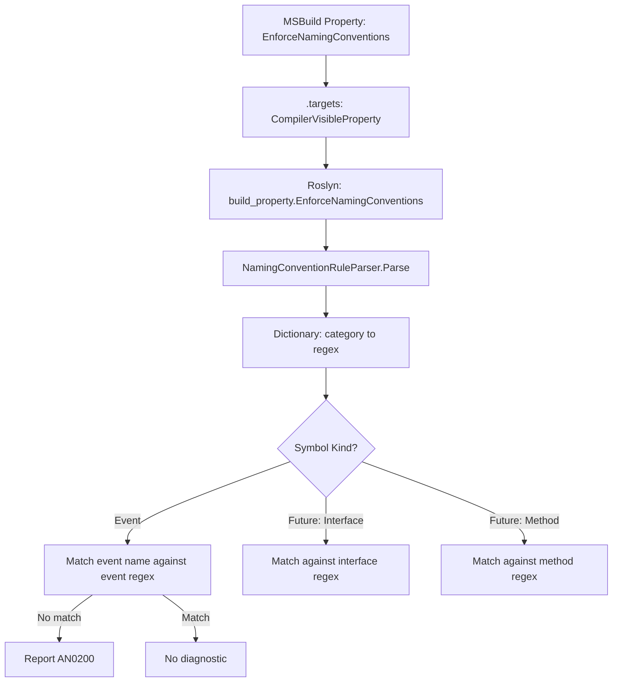

# AN0200: EnforceNamingConventions

## Summary

| | |
|---|---|
| **ID** | AN0200 |
| **Category** | AN.NamingConventions |
| **Default Severity** | Warning |
| **Configurable** | Yes — JSON-like rule string in MSBuild property |

A Roslyn analyzer that enforces configurable naming conventions via regex patterns. The MSBuild property value is a JSON/HJSON-like string parsed at analysis time. Phase 1 targets **event** declarations only; the architecture supports future expansion to methods, properties, fields, etc.

---

## Configuration

```xml
<PropertyGroup>
  <EnforceNamingConventions>{ event = "On.*" }</EnforceNamingConventions>
</PropertyGroup>
```

The value is a brace-delimited set of `key = "value"` pairs where:
- **key** = symbol category (`event`, and future: `method`, `property`, `field`, `class`, `interface`, etc.)
- **value** = regex pattern the symbol name must match (anchored: implicitly wrapped in `^(?:...)$`)

Multiple rules:
```xml
<EnforceNamingConventions>{ event = "On.*", interface = "I.*" }</EnforceNamingConventions>
```

Disabled (default when property absent): no diagnostics.

---

## Error Message

```
AN0200: Event 'ButtonClick' does not match required naming pattern 'On.*'. Rename to match the convention.
```

---

## Currently Supported Symbol Categories

- [x] **event** — Event declarations (field-like and custom add/remove)

## Future Symbol Categories (Phase 2+)

- [ ] **interface** — Interface type declarations (e.g., `I.*` for IDisposable pattern)
- [ ] **class** — Class type declarations
- [ ] **struct** — Struct type declarations
- [ ] **enum** — Enum type declarations
- [ ] **method** — Method declarations
- [ ] **property** — Property declarations
- [ ] **field** — Field declarations
- [ ] **parameter** — Method/constructor parameters
- [ ] **type_parameter** — Generic type parameters (e.g., `T.*` for generic types)
- [ ] **namespace** — Namespace declarations
- [ ] **delegate** — Delegate type declarations

### Potential Scope Qualifiers (Phase 3+)

- [ ] **public_method**, **private_method**, **internal_method** — visibility-scoped rules
- [ ] **static_method**, **instance_method** — modifier-scoped rules
- [ ] **async_method** — async method naming conventions
- [ ] **const_field**, **readonly_field** — field modifier-scoped rules

---

## Phased Implementation Plan

### Phase 1 — Core analyzer with event naming (this task)

- [ ] **P1.1 — Create directory structure**
  - `EnforceNamingConventions/EnforceNamingConventionsAnalyzer.cs`
  - `EnforceNamingConventions/NamingConventionRuleParser.cs`
  - `EnforceNamingConventions/Tests/AN.CodeAnalyzers.EnforceNamingConventions.Tests.csproj`
  - `EnforceNamingConventions/Tests/EnforceNamingConventionsAnalyzerTests.cs`
  - `EnforceNamingConventions/Tests/EnforceNamingConventionsVerifierHelper.cs`

- [ ] **P1.2 — Implement `NamingConventionRuleParser`**
  - Parses `{ event = "On.*" }` from the MSBuild property string
  - Returns `Dictionary<string, string>` of category → regex pattern
  - Handles: whitespace, quoted values, multiple comma-separated rules
  - No external dependencies (inline parser, netstandard2.0 compatible)
  - Graceful error handling: malformed input → empty rules (no crash)

- [ ] **P1.3 — Implement `EnforceNamingConventionsAnalyzer`**
  - `DiagnosticAnalyzer` registered for `LanguageNames.CSharp`
  - Diagnostic ID: `AN0200`
  - Reads `build_property.EnforceNamingConventions` via `AnalyzerConfigOptionsProvider`
  - Parses rules once per compilation via `RegisterCompilationStartAction`
  - Registers `RegisterSymbolAction` for `SymbolKind.Event`
  - For each event symbol: check name against the `event` regex pattern
  - Report diagnostic if name does not match

- [ ] **P1.4 — Wire up MSBuild integration**
  - Add `<CompilerVisibleProperty Include="EnforceNamingConventions" />` to `build/ArtificialNecessity.CodeAnalyzers.targets`

- [ ] **P1.5 — Exclude test directory from main csproj**
  - Verify `EnforceNamingConventions/Tests/**` is covered by the existing `**/Tests/**` exclude in `AN.CodeAnalyzers.csproj`

- [ ] **P1.6 — Create test project**
  - `AN.CodeAnalyzers.EnforceNamingConventions.Tests.csproj` following the pattern from `ExplicitEnums/Tests/`
  - `EnforceNamingConventionsVerifierHelper.cs` — helper that injects `build_property.EnforceNamingConventions` via `.globalconfig`
  - Add test project to `AN_CodeAnalyzers.sln` with solution folder nesting

- [ ] **P1.7 — Write tests**
  - Event matches pattern → no diagnostic
  - Event does not match pattern → AN0200 diagnostic
  - No config property set → no diagnostic (disabled by default)
  - Empty/malformed config → no diagnostic (graceful)
  - Multiple rules in config → only event rule applied to events
  - Regex edge cases: exact match, prefix, suffix patterns

- [ ] **P1.8 — Build and verify**
  - `dotnet build` succeeds
  - `dotnet test` passes all new tests
  - Existing tests still pass

### Phase 2 — Future expansion (not this task)

- [ ] Add support for `interface = "I.*"` (SymbolKind.NamedType where TypeKind == Interface)
- [ ] Add support for `method`, `property`, `field`, `class` categories
- [ ] Add support for scope qualifiers: `public_method`, `private_field`, etc.
- [ ] Add support for `!pattern` (negation / exclusion patterns)
- [ ] Update README.md with documentation

---

## Architecture



---

## Files to Create/Modify

| Action | File |
|--------|------|
| CREATE | `EnforceNamingConventions/EnforceNamingConventionsAnalyzer.cs` |
| CREATE | `EnforceNamingConventions/NamingConventionRuleParser.cs` |
| CREATE | `EnforceNamingConventions/Tests/AN.CodeAnalyzers.EnforceNamingConventions.Tests.csproj` |
| CREATE | `EnforceNamingConventions/Tests/EnforceNamingConventionsAnalyzerTests.cs` |
| CREATE | `EnforceNamingConventions/Tests/EnforceNamingConventionsVerifierHelper.cs` |
| MODIFY | `build/ArtificialNecessity.CodeAnalyzers.targets` — add CompilerVisibleProperty |
| MODIFY | `AN_CodeAnalyzers.sln` — add test project + solution folder |

No changes needed to `AN.CodeAnalyzers.csproj` — the existing `**/Tests/**` exclude already covers the new test directory, and the analyzer source files will be auto-included by the SDK glob.